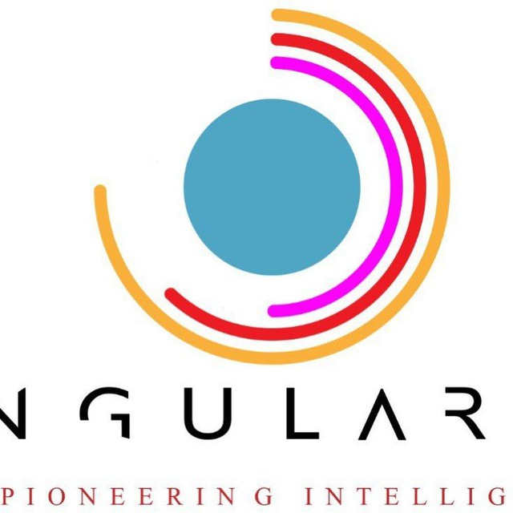

<!-- Improved compatibility of back to top link: See: https://github.com/othneildrew/Best-README-Template/pull/73 -->

<a name="readme-top"></a>

<!--
*** Thanks for checking out the Best-README-Template. If you have a suggestion
*** that would make this better, please fork the repo and create a pull request
*** or simply open an issue with the tag "enhancement".
*** Don't forget to give the project a star!
*** Thanks again! Now go create something AMAZING! :D
-->

<!-- PROJECT SHIELDS -->
<!--
*** I'm using markdown "reference style" links for readability.
*** Reference links are enclosed in brackets [ ] instead of parentheses ( ).
*** See the bottom of this document for the declaration of the reference variables
*** for contributors-url, forks-url, etc. This is an optional, concise syntax you may use.
*** https://www.markdownguide.org/basic-syntax/#reference-style-links
-->

[![Contributors][contributors-shield]][contributors-url]
[![Forks][forks-shield]][forks-url]
[![Stargazers][stars-shield]][stars-url]
[![Issues][issues-shield]][issues-url]
[![MIT License][license-shield]][license-url]
[![LinkedIn][linkedin-shield]][linkedin-url]

<!-- PROJECT LOGO -->
<br />
<div align="center">
  <a href="https://github.com/SingularityAi8/Semblance">
    
  </a>

<h3 align="center">Semblance</h3>

  <p align="center">
    Semblance is an AI-powered mobile app for the visually impaired. With voice commands and OpenAI's GPT-3, users get accurate and precise information on-the-go. Built with React Native/Kotlin and Python/Node.js.
    <br />
    <a href="https://github.com/SingularityAi8/Semblance"><strong>Explore the docs »</strong></a>
    <br />
    <br />
    <a href="https://github.com/SingularityAi8/Semblance">View Demo</a>
    ·
    <a href="https://github.com/SingularityAi8/Semblance/issues">Report Bug</a>
    ·
    <a href="https://github.com/SingularityAi8/Semblance/issues">Request Feature</a>
  </p>
</div>

<!-- TABLE OF CONTENTS -->
<details>
  <summary>Table of Contents</summary>
  <ol>
    <li>
      <a href="#about-the-project">About The Project</a>
      <ul>
        <li><a href="#built-with">Built With</a></li>
      </ul>
    </li>
    <li>
      <a href="#getting-started">Getting Started</a>
      <ul>
        <li><a href="#prerequisites">Prerequisites</a></li>
        <li><a href="#installation">Installation</a></li>
      </ul>
    </li>
    <li><a href="#usage">Usage</a></li>
    <li><a href="#roadmap">Roadmap</a></li>
    <!-- <li><a href="#contributing">Contributing</a></li> -->
    <li><a href="#license">License</a></li>
    <li><a href="#contact">Contact</a></li>
    <li><a href="#acknowledgments">Acknowledgments</a></li>
  </ol>
</details>

<!-- ABOUT THE PROJECT -->

## About The Project

<!-- [![Product Name Screen Shot][product-screenshot]](https://example.com) -->

<!-- Here's a blank template to get started: To avoid retyping too much info. Do a search and replace with your text editor for the following: `SingularityAi8`, `Semblance`, `Singularity_IA`, `jason-quist-4a0651261`, `email_client`, `email`, `Semblance`, `Semblance is an AI-powered mobile app for the visually impaired. With voice commands and OpenAI's GPT-3, users get accurate and precise information on-the-go. Built with React Native/Kotlin and Python/Node.js.` -->

<p align="right">(<a href="#readme-top">back to top</a>)</p>

### Built With

- 
- 
- 
- 

<p align="right">(<a href="#readme-top">back to top</a>)</p>

<!-- GETTING STARTED -->

## Getting Started

<!-- This is an example of how you may give instructions on setting up your project locally. -->

To get a local copy up and running follow these simple example steps.

### Prerequisites

<!-- This is an example of how to list things you need to use the software and how to install them. -->

- npm
  ```sh
  npm install npm@latest -g
  ```

### Installation

1. Get a free API Key at [https://example.com](https://example.com)
2. Clone the repo
   ```sh
   git clone https://github.com/SingularityAi8/Semblance.git
   ```
3. Install NPM packages
   ```sh
   npm install
   ```
4. Enter your API in `config.js`
   ```js
   const API_KEY = "ENTER YOUR API";
   ```

<p align="right">(<a href="#readme-top">back to top</a>)</p>

<!-- USAGE EXAMPLES -->

## Usage

<!-- Use this space to show useful examples of how a project can be used. Additional screenshots, code examples and demos work well in this space. You may also link to more resources. -->

<!-- _For more examples, please refer to the [Documentation](https://example.com)_ -->

<p align="right">(<a href="#readme-top">back to top</a>)</p>

<!-- ROADMAP -->

## Roadmap

- [ ] Feature 1
- [ ] Feature 2
- [ ] Feature 3
  - [ ] Nested Feature

See the [open issues](https://github.com/SingularityAi8/Semblance/issues) for a full list of proposed features (and known issues).

<p align="right">(<a href="#readme-top">back to top</a>)</p>

<!-- CONTRIBUTING -->

<!-- ## Contributing

Contributions are what make the open source community such an amazing place to learn, inspire, and create. Any contributions you make are **greatly appreciated**.

If you have a suggestion that would make this better, please fork the repo and create a pull request. You can also simply open an issue with the tag "enhancement".
Don't forget to give the project a star! Thanks again!

1. Fork the Project
2. Create your Feature Branch (`git checkout -b feature/AmazingFeature`)
3. Commit your Changes (`git commit -m 'Add some AmazingFeature'`)
4. Push to the Branch (`git push origin feature/AmazingFeature`)
5. Open a Pull Request

<p align="right">(<a href="#readme-top">back to top</a>)</p> -->

<!-- LICENSE -->

## License

Distributed under the MIT License. See `LICENSE.txt` for more information.

<p align="right">(<a href="#readme-top">back to top</a>)</p>

<!-- CONTACT -->

## Contact

Jason - [@Singularity_IA](https://twitter.com/Singularity_IA) - email@email_client.com

Project Link: [https://github.com/SingularityAi8/Semblance](https://github.com/SingularityAi8/Semblance)

<p align="right">(<a href="#readme-top">back to top</a>)</p>

<!-- ACKNOWLEDGMENTS -->

## Collaborators

- [Khadija El Gueddari](https://www.linkedin.com/in/khadija-el-gueddari-363a52231)
- [Louis Yeung](https://www.linkedin.com/in/louis-yeung/)
- [Mark Gitaka](https://www.linkedin.com/in/mark-gitaka-0083b5166)
- [Muhammad Arham](https://www.linkedin.com/in/muhammad-arham-95b8331a4)
- [Salima Bouhamidi](https://www.linkedin.com/in/salima-bouhamidi-01a72a196)
- [Kay Cee](https://linkedin.com/in/sekaycee)
- [Lee Guan Feng](https://www.linkedin.com/in/lee-guan-feng/)

<p align="right">(<a href="#readme-top">back to top</a>)</p>

<!-- MARKDOWN LINKS & IMAGES -->
<!-- https://www.markdownguide.org/basic-syntax/#reference-style-links -->

[contributors-shield]: https://img.shields.io/github/contributors/SingularityAi8/Semblance.svg?style=for-the-badge
[contributors-url]: https://github.com/SingularityAi8/Semblance/graphs/contributors
[forks-shield]: https://img.shields.io/github/forks/SingularityAi8/Semblance.svg?style=for-the-badge
[forks-url]: https://github.com/SingularityAi8/Semblance/network/members
[stars-shield]: https://img.shields.io/github/stars/SingularityAi8/Semblance.svg?style=for-the-badge
[stars-url]: https://github.com/SingularityAi8/Semblance/stargazers
[issues-shield]: https://img.shields.io/github/issues/SingularityAi8/Semblance.svg?style=for-the-badge
[issues-url]: https://github.com/SingularityAi8/Semblance/issues
[license-shield]: https://img.shields.io/github/license/SingularityAi8/Semblance.svg?style=for-the-badge
[license-url]: https://github.com/SingularityAi8/Semblance/blob/master/LICENSE.txt
[linkedin-shield]: https://img.shields.io/badge/-LinkedIn-black.svg?style=for-the-badge&logo=linkedin&colorB=555
[linkedin-url]: https://linkedin.com/in/jason-quist-4a0651261
[product-screenshot]: images/screenshot.png
